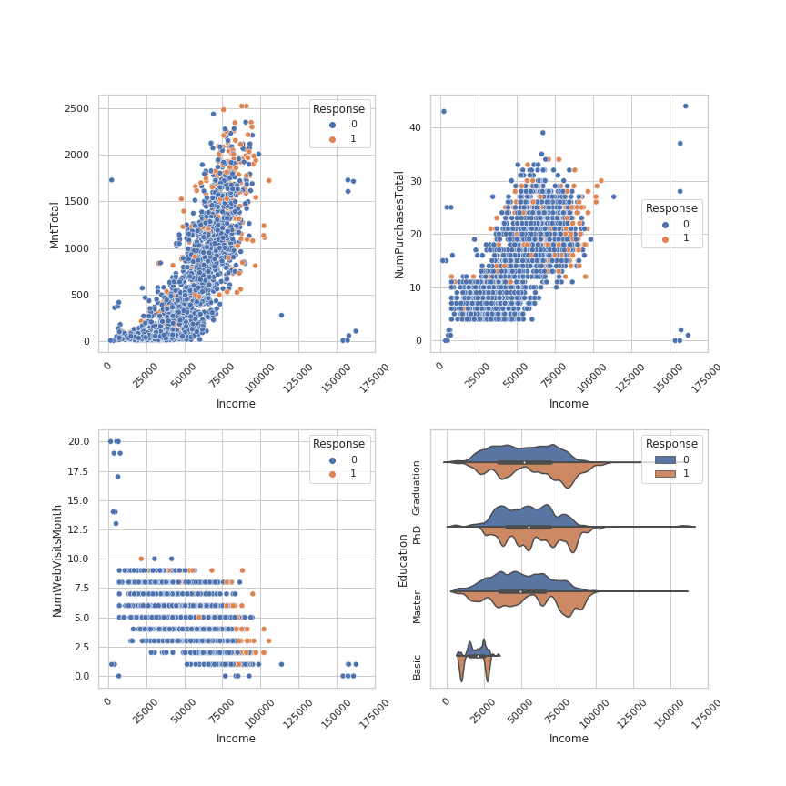
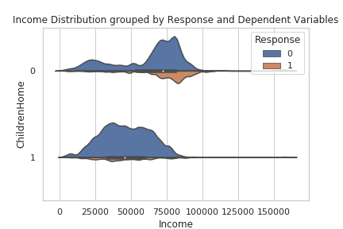
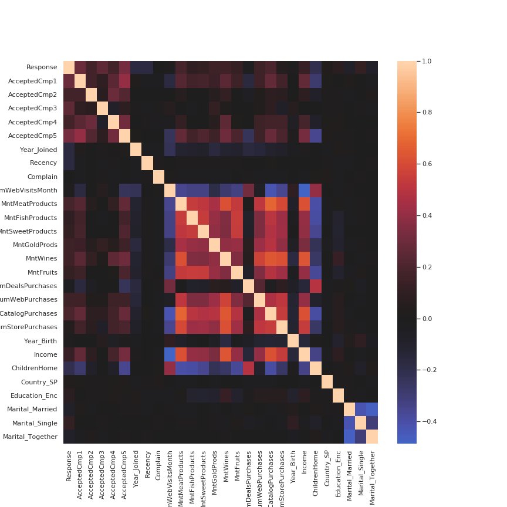

# iFood-Marketing-Campaign

This project uses data from iFood, a Brazilian food delivery platform. The dataset has 2200+ rows of customers and contains demographic information and buying behavior for each. Python code for this analysis can be found in the file "mkt_proj.ipynb" 
  
  
After cleaning up data types and encoding categorical features, I handle missing "income" data with regression imputation.
Regressinon impuation uses other features as predictors to model and estimate the missing data. Though this technique introduces error, it has an advantage over mean impuation because it preserves the relationships between income and other demographic and behavior data which is unlikely to be random. To improve this model for imputation, I would use log(income) as the response, because income data tends to follow an exponential distribution. This would result in more accurate predictons for higher incomes.

I then use Seaborn for visualizations to explore the relationships in demographics and customer activity, below are some of visualizations I found interesting or insightful. 

In this 2x2 facet, the scatterplots display the correlations between Income and Total Expenditure (MntTotal), Total Number of Purchases (NumPurchasesTotal), Num of Monthly Web Visits, and a violin plot showing the Income distribution per level of education. Each data point is color coded to the response variable, whether or not the customer accepted the recent marketing promotion. 

#### 2x2 facet of Scatterplots featuring Income on X axis
  

In the top left scatter plot, it is evident that Income and Total Expenditure have a strong positive correlation. It also appears that those labled as promotion responders (orange) outspent customers of similar income levels.  
This is reinforced in the top right plot showing a similar correlation between Income and Num of Total Purchases. Visually it does not appear that upper-middle income promotion responders (orange) made more purchases than customer sof similar income level, indicating that the promotion may have led to larger orders rathen than more frequent ones.  
The bottom left plot interesting shows a negative correlation between income and Number of Monthly Web Visits. This seems contradictory to the previous plots showing a positive corelation between Income and Buying Behaviors, and might *imply that higher income customers buy more impulsively and with less consideration than their lower income counterparts*.  
Finally the Bottom right plot shows a violin plot betwene Income and levels of Education. The violin plot is interesting because it shows the min, max, mean, and quartiles while also displaying the distributions for the bivariate response variable. From the plot we can see a correlation between higher education and income, but also see that promotion responders trend towards having higher incomes than non-responders.  

#### Violin Plot of Total Expenditure (MntTotal) grouped by Children and Response
  

This violin plot acts like a box and whisker plot, showing min, max, mean, and quartiles, while also showing the distribution of the numerical Income data.
In addition, the distributions are grouped by the promotional Repsonse variable and the presence of Children in the home with the size of the distribution representing the portion of the overall data being represented.  
As can be seen, on-respodners grwatly out number responders, and the trend of lower income households being more likely to have children is evident. Responders are more likely not have children and also have a higher income that non-repsonders without children.

#### Correlation Heatmap
  

This Correlation Heatmap shows the presence of multicollinearity between features of the data, with Red and Yellow shoing positive correlation and Blue showing negative correlation. This level of multicollinearity is concerning for many learning algorithms, hence why I chose a Random Forest. Robustness from bootstrap and feature sampling, plus cross validation, will minimze the loss of precision introduced by the multicollinearity.

Lastly, I use random forest classification to predict whether or not a customer has responded to the latest marketing campaign and tune the model's parameters using both the visual "elbow technique" to balance bias-variance tradeoff and with a randomized grid search.

This model and visualizations can be used to estimate returns from the marketing campaign and determine what demographics to target. 
At a future time, I wish to cluster the customer's to get a better idea of the market demographics.
